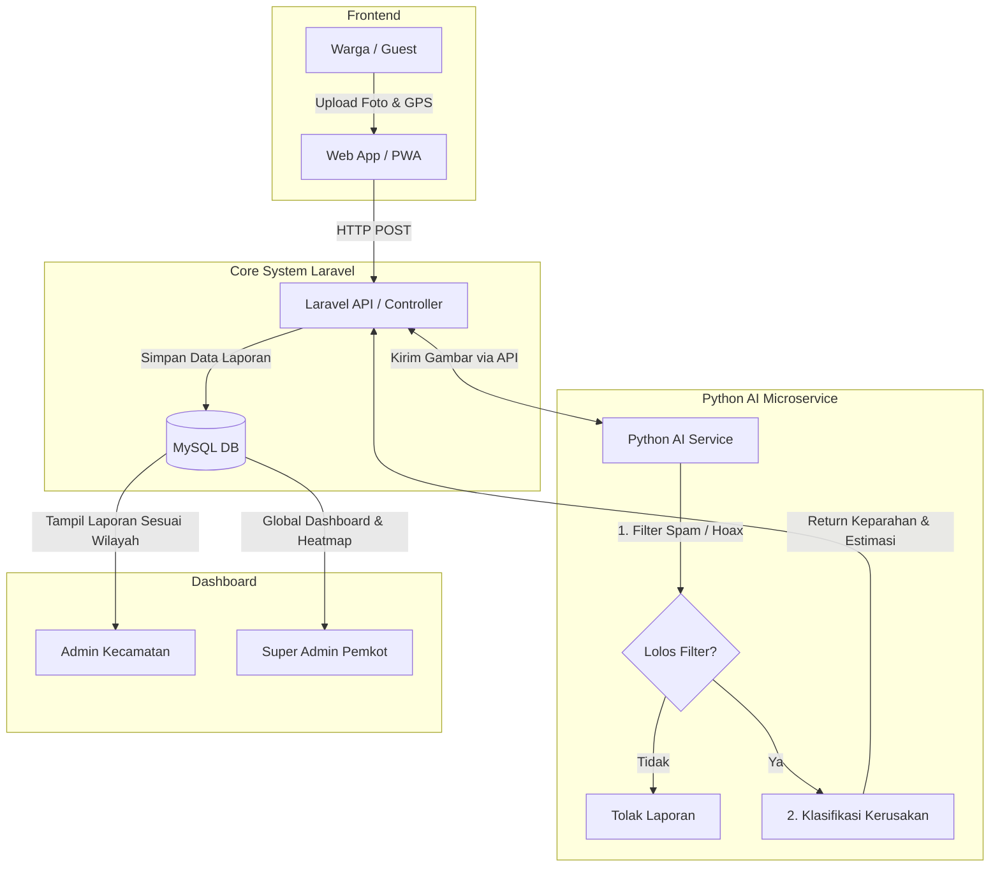

# 🏙️ SIGAP BDG (Sistem Informasi Gangguan, Keamanan, dan Pelaporan Bandung)
**Product Requirements Document (PRD) & Master Canvas**

## 1. Ringkasan Proyek (Project Overview)
**SIGAP BDG** adalah Sistem Informasi Pelaporan Publik berbasis web (PWA) yang dirancang untuk mengatasi masalah infrastruktur (SDG 9) dan keamanan publik (SDG 11) di Kota Bandung. Sistem ini memungkinkan warga melapor secara anonim tanpa perlu *login*, menggunakan bantuan *Artificial Intelligence* (AI) untuk klasifikasi kerusakan jalan dan *Location-Based Service* (LBS) untuk kedaruratan kejahatan.

---

## 2. Hierarki Pengguna (Aktor / User Roles)
Sistem ini memiliki 3 aktor utama dengan *role* dan hak akses yang berbeda:

1. **Warga (Pelapor / Guest User)**
   * **Deskripsi:** Masyarakat umum di Kota Bandung.
   * **Hak Akses:** Tidak perlu *login* (Guest). Bisa mengirim laporan, mengambil foto dari sistem, membagikan lokasi GPS, dan melacak status laporan menggunakan *Tracking ID*.
2. **Pemerintah Daerah (Admin Kecamatan / Kelurahan)**
   * **Deskripsi:** Operator di tingkat kewilayahan (Contoh: Admin Kecamatan Buah Batu).
   * **Hak Akses:** Wajib *login*. Menerima laporan terverifikasi (khusus wilayahnya) dari sistem, mengubah status penanganan (Proses -> Selesai), dan mengajukan/mengonfirmasi pencairan dana perbaikan ke Pemkot.
3. **Super Admin (Pemerintah Kota Bandung / Pemkot)**
   * **Deskripsi:** Pengendali pusat tata ruang dan tata pemerintahan Kota Bandung.
   * **Hak Akses:** Wajib *login*. Memiliki *dashboard* analitik (*Heatmap*), melihat seluruh laporan di semua wilayah, dan memberikan *approval* (persetujuan) atas pengajuan dana dari Kecamatan.

---

## 3. Logika Bisnis & Fitur Utama (Core Features)

### A. Modul Infrastruktur (Jalan Rusak)
1. **Pindai & Lapor:** Warga memindai *QR Code* di lokasi atau langsung membuka web, mengizinkan akses GPS, lalu mengambil foto kerusakan jalan (langsung dari kamera web, mencegah *upload* foto lama).
2. **AI Processing (Backend):** * AI mendeteksi **Jenis Kerusakan** (berlubang, retak, aspal terkelupas).
   * AI mendeteksi **Tingkat Keparahan** (Ringan, Sedang, Berat).
   * Sistem otomatis menghitung estimasi anggaran kasar berdasarkan matriks keparahan x luas perkiraan.
3. **Geo-Routing:** Laporan dikirim otomatis ke *dashboard* Admin Kecamatan sesuai dengan koordinat GPS laporan tersebut.
4. **Tindak Lanjut & Approval:** Admin Kecamatan memverifikasi laporan, menekan tombol "Ajukan Dana". Super Admin menyetujui, lalu Admin Kecamatan mengubah status menjadi "Dalam Perbaikan" dan akhirnya "Selesai" (wajib melampirkan foto bukti perbaikan).

### B. Modul Keamanan (Tindak Kejahatan)
1. **Panic Button & LBS:** Warga memilih menu "Lapor Kejahatan". Sistem membaca *Longitude* dan *Latitude* gawai pengguna.
2. **Geo-Fencing Police Routing:** Menggunakan *Geospatial Query*, sistem langsung menampilkan tombol panggilan darurat (telepon/WhatsApp) yang terhubung **langsung ke Polsek terdekat** dari lokasi warga saat itu.
3. **Anonimitas:** Data identitas gawai disembunyikan, hanya titik lokasi yang diteruskan.

---

## 4. Arsitektur Sistem & Tech Stack (High-Level)
* **Frontend:** Blade Templating (Laravel) / Tailwind CSS (Mobile Responsive).
* **Backend Core:** Laravel 11 (PHP 8.2) untuk *Routing*, CRUD, dan Manajemen *Role*.
* **AI Microservice:** Python (FastAPI/Flask) menggunakan model *Computer Vision* (contoh: YOLOv8) untuk deteksi gambar infrastruktur dan deteksi Spam.
* **Database:** MySQL / PostgreSQL (dengan ekstensi PostGIS untuk *Geospatial*).

### Visualisasi Arsitektur (Mermaid)

## 5. Mitigasi Spam & Keamanan (NFR - Security)

Karena pelapor adalah Guest (Tanpa Akun), sistem menerapkan mitigasi spam berlapis:

### Lapisan 1: Geofencing & Real-Time Capture

Web wajib meminta izin Location Services. Laporan ditolak jika koordinat berada di luar batas poligon Kota Bandung.

Input gambar diwajibkan menggunakan integrasi kamera (live capture), menonaktifkan fitur ambil dari galeri untuk mencegah laporan masa lalu/palsu.

### Lapisan 2: Rate Limiting

Membatasi pengiriman laporan maksimal 3 kali per jam dari 1 alamat IP atau Device Fingerprint yang sama.

### Lapisan 3: AI Spam Classifier (Validasi Citra)

Sebelum diproses anggarannya, gambar dikirim ke model AI Python. AI akan mengklasifikasikan apakah gambar tersebut benar-benar mengandung unsur infrastruktur jalan (aspal, beton, tanah, marka jalan). Jika AI mendeteksi gambar wajah (selfie), gambar ruangan indoor, atau gambar hitam legam, laporan otomatis ditolak / di-drop di latar belakang.

---

## 6. Prompting Guide (Panduan Menggunakan AI bagi Tim)

**PENTING UNTUK TIM DEVELOPER/ANALYST:** Gunakan template prompt di bawah ini dengan melakukan Copy-Paste seluruh dokumen di atas terlebih dahulu ke dalam AI (ChatGPT, Gemini, Claude, dll), lalu tambahkan perintah spesifik Anda di bawahnya.

### Prompt untuk Membuat Use Case Diagram
Berdasarkan dokumen PRD SIGAP BDG di atas, bertindaklah sebagai System Analyst. Buatkan daftar skenario Use Case secara mendetail lengkap dengan Pre-condition, Post-condition, dan Main Success Scenario untuk Aktor 'Admin Kecamatan'.

### Prompt untuk Membuat ERD (Entity Relationship Diagram)
Berdasarkan dokumen PRD SIGAP BDG di atas, bertindaklah sebagai Database Engineer. Rancanglah ERD lengkap beserta atribut, primary key, dan foreign key-nya. Tolong berikan output dalam bentuk kode Mermaid.js untuk ERD.

### Prompt untuk Membuat BPMN (Alur Proses Bisnis)
Berdasarkan dokumen PRD SIGAP BDG di atas, buatkan langkah-langkah Business Process Modeling Notation (BPMN) dalam bentuk teks terstruktur untuk 'Modul Infrastruktur (Jalan Rusak)', mulai dari Warga memindai QR code sampai Super Admin menyetujui anggaran.
